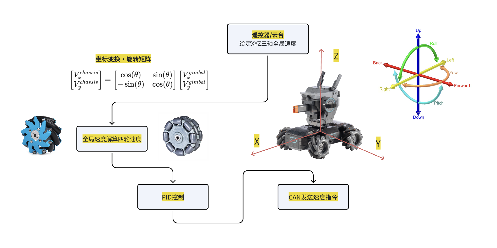

# *若有问题，请仔细阅读完该readme后，再于群中提问*

> 💡 **推荐阅读：「提问的艺术（RM版）」**
>
> 学会提问，才能真正学会解决问题。  
> 本文基于《How To Ask Questions The Smart Way》并结合 RoboMaster 圈经验撰写，  
> 是每一位队员必读的沟通指南。
>
> 👉 [点击阅读原文](https://bbs.robomaster.com/article/810096?source=1)

# 麦克纳姆轮和全向轮底盘控制代码
#### 声明：虽然底盘支持遥控器单独控制，但正式比赛时是接收云台传回的数据而非遥控器数据！用户需在chassisc.cpp的第11行修改宏定义以适配不同场景

## 简介

本套代码实现了麦克纳姆轮和全向轮四轮底盘的控制。

## 控制框图


## 项目概述

这是一个用于控制麦克纳姆轮和全向轮四轮底盘的嵌入式C++项目。项目基于STM32F4系列微控制器（具体为STM32F407IGHx），使用大疆C型开发板和3508轮毂电机。

主要功能包括：
- 底盘运动控制（支持麦克纳姆轮和全向轮两种模式）
- 通过CAN总线与电机驱动器通信
- 通过UART接收遥控器指令（支持FSI6遥控器）
- 使用FreeRTOS进行任务调度
- 实现了PID控制器用于电机速度控制

## 项目结构

```
D:\Dev\EGA_Dev\EGA_CHASSIS_EXAMPLE\
├── Core/                     # STM32 HAL库核心代码
├── Drivers/                  # STM32 HAL驱动和CMSIS库
├── Middlewares/              # 中间件（FreeRTOS、ARM DSP库）
├── User/                     # 用户代码
│   ├── Framework/            # 核心控制逻辑（底盘、电机、PID、遥控器等）
│   ├── MCUDriver/            # MCU外设驱动（CAN、LED、UART）
│   └── Tasks/                # FreeRTOS任务
├── CMakeLists.txt            # CMake构建配置
└── README.md                 # 项目说明
```

## 核心组件

### 底盘控制 (ChassisC)
- 文件: `User/Framework/chassisc/chassisc.hpp`, `User/Framework/chassisc/chassisc.cpp`
- 实现了底盘运动控制的核心逻辑，包括正/逆运动学解算、速度控制、加速度控制等
- 支持两种底盘类型：麦克纳姆轮(MECANUM_WHEEL)和全向轮(OMNI_WHEEL)
- 通过CAN总线与四个3508电机通信
- 通过UART接收遥控器指令

### 电机控制 (MotorC)
- 文件: `User/Framework/motorc/motorc.hpp`, `User/Framework/motorc/motorc.cpp`
- 封装了单个电机的控制逻辑
- 集成了PID控制器用于速度闭环控制
- 处理电机编码器数据，计算角度、速度等信息

### 遥控器处理 (cRemote)
- 文件: `User/Framework/remotec/remotec.hpp`, `User/Framework/remotec/remotec.cpp`
- 支持`DT7->DR16`和`FSi6x<->ia10b`遥控器
- 通过UART接收遥控器数据并解析
- 将遥控器输入转换为底盘目标速度

### PID控制器 (PidC)
- 文件: `User/Framework/pidc/pidc.hpp`, `User/Framework/pidc/pidc.cpp`
- 实现了位置式和增量式PID控制算法
- 用于电机速度控制

## 构建和烧录

### 构建系统
项目使用CMake作为构建系统，目标平台为ARM Cortex-M4。

### 编译器
- 使用 `arm-none-eabi-gcc` 工具链进行交叉编译
- C++标准: C++17
- C标准: C11

### 构建配置
- 处理器: Cortex-M4
- 浮点运算: 硬件浮点 (hard float)
- 优化选项: 根据构建类型设置 (-Ofast, -Os, -Og等)


### 烧录
项目生成.HEX和.BIN格式的固件文件，可以使用Dap-Link或其他兼容的调试器进行烧录。

## 开发约定

1. 代码使用C++17标准编写
2. 使用STM32 HAL库进行硬件抽象
3. 使用FreeRTOS进行多任务管理
4. 电机控制采用PID算法进行速度闭环控制
5. 通过CAN总线与电机驱动器通信
6. 通过UART接收遥控器指令
7. 使用CMake进行项目构建

## 关键配置参数

1. 底盘类型在 `chassisc.hpp` 中通过 `chassis_type` 变量配置
2. 底盘控制方式在 `chassisc.hpp` 中通过宏定义选择。
_注意在仅有底盘时不支持小陀螺控制_
3. 电机PID参数在 `motorc.hpp` 中定义
4. 底盘PID参数在 `chassisc.hpp` 中定义
5. 遥控器类型在 `remotec.hpp` 中通过宏定义选择。
- [FSI6x控制方式](User/Framework/remotec/remote_readme.md)

## 主要任务

项目使用FreeRTOS进行任务调度，主要任务在 `User/Tasks/chassis_task` 目录中定义。

## 常见问题

- 富斯遥控器无法开机怎么办？
  - 富斯开机时要求四个switch均在最上方，且左摇杆在最下方，
- 遥控器寄了无法控制怎么办？
  - 首先检查宏定义是否正确，是否是对应的遥控器型号
  - 其次按rst按键重启C板，串口通讯有点小bug导致有概率收到乱序数据，只能靠重启解决
- 疯车乱跑怎么办？
  - 在确定不会出问题之前，必须给车悬空测试(架凳子上，同时防止轮组与物体接触)
  - 可以通过串口打印，一步一步从控制数据往前走，看看是什么导致了疯车
- 串口接收不到数据怎么办？
  - 检查串口是否正确(端口简介是否包含USB字样)
  - 检查Vofa中串口参数是否与MX配置一致(波特率等)
  - 检查你发送的数据是否以换行符结尾，各个数值之间是否以逗号分割(firewater的格式要求是这样)
- 串口打印经常出现乱码数据或乱序数据怎么办？
  - usart_printf需要一定时间才能发送完数据，所以在其正在发送数据的时候不能再调用usart_printf。建议在每次控制循环中只打印一次(只调用一次printf函数)，一定不要在printf后加HAL_Delay!!!
  - 检查Vofa中串口参数是否与MX配置一致(波特率等)

### 在群里问问题之前，你应该:
1. 善用搜索
2. 问你所在的小组的成员，每个小组都有至少一名战队成员
3. 在以上两步均没有结果后，再在群里提问

在群里提问时，请先简述你上网查询以及与组员讨论的结果，让我们知道你已经仔细阅读readme并按照步骤提问。